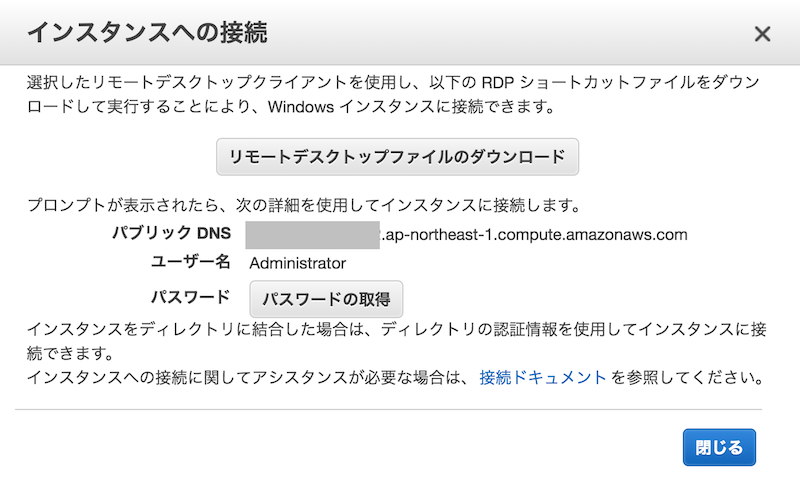
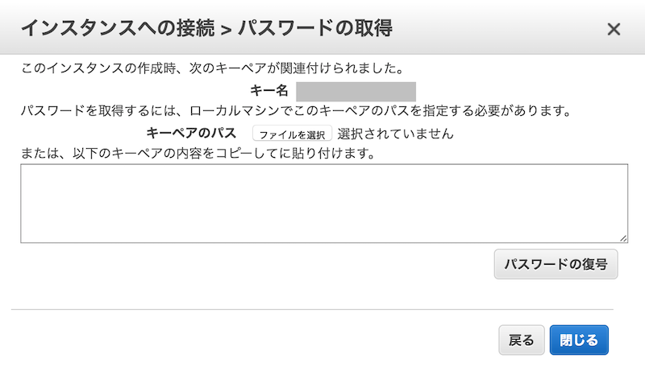

# AWS Windows のパスワード

## 第29回シェル芸勉強会 大阪サテライトLT
## 2017/7/1
## so

>>>

- [スライド](https://horo17.github.io/aws-windows-password/)

---

## `$ whoami`


* so ([@3socha](https://twitter.com/3socha))
* インフラエンジニア (AWS)
  * 最近は AWS 上で Windows 系のシステムを構築
* 今回から会場代表を引き継ぎました
  * 相変わらずエアコンの手配がグダっててすみません

---

## AWS Windows のパスワード

1. キーペアに RSA 公開鍵を登録
1. Windows インスタンス起動時に Administrator のパスワードが自動生成される
1. パスワード取得時は AWS に登録した RSA 公開鍵で暗号化された ciphertext が返ってくる
1. ローカルの秘密鍵で復号化し、パスワードを取得
1. リモートデスクトップ / PowerShell で接続

>>>

## マネジメントコンソール上で復号化



>>>



>>>

- マネジメントコンソールから復号化する場合、秘密鍵のパスフレーズを解かないといけない
  - (ブラウザ上 JS で RSA 復号化処理が実行されるので、秘密鍵がアップロードされるわけではない)
- せめて一時的にクリップボードに入れるか

```sh
$ openssl rsa -in ~/.ssh/id_rsa | pbcopy
```

>>>

## どうせコマンドを使うので全て CLI で

```sh
$ aws ec2 get-password-data \
  --instance-id ${InstanceId}
{
    "InstanceId": "i-09f6dc6d8146b0219",
    "Timestamp": "2017-07-01T05:09:57.000Z",
    "PasswordData": "\r\nX0sjXfiGEliOQvj3grOZtJEdcVWSdbKAcQzYZBrbgg6r7mcOfTCAaWiZp8sExcA0BWiwVyBKWrR2EVJbJfC1n88UJ8cg2oqZ5PuXkEhZ1pmLeamNrlK7XsGukeB+FsEel+WRiXdeybFa1Pc9vKXsDnuZSeDEaBuuclSMnUf0Rxnyps+ph81E7MNn/qobfJPncfpQhjj1R61QY4FtFYYxHU9grcrtGvzjkoS/edZl+1viQY3E4bLX6lwFgT8llwRhzxhtyUCilPaxXn8OaPBdUpwVHXt+czawSsF6/qRPyM3Li8lZ4g/A1HOKp0BIfIWe+6eXDdAFsAYaB+Kil18V0g==\r\n"
}
```

- Base64 エンコードされた `PasswordData` が ciphertext
- `\r\n` で挟まれてるのが Windows らしくてキモいですね

>>>

## ワンライナーで

```sh
$ aws ec2 get-password-data \
  --instance-id ${InstanceId} \
  --query PasswordData | \
  sed 's/\"\\r\\n//;s/\\r\\n\"//' | \
  base64 -d | \
  openssl rsautl -inkey ~/.ssh/id_rsa -decrypt
```

- `jq` でパースしても良いが、`--query` で必要なフィールドだけ取ってくる

>>>

## シェル芸を使った方が安全

- 何やってるか、わかる人にはわかりやすい
- 安心

---

## 参考

- https://serverfault.com/questions/603984/windows-password-wont-decrypt-on-aws-ec2-even-with-the-correct-private-key